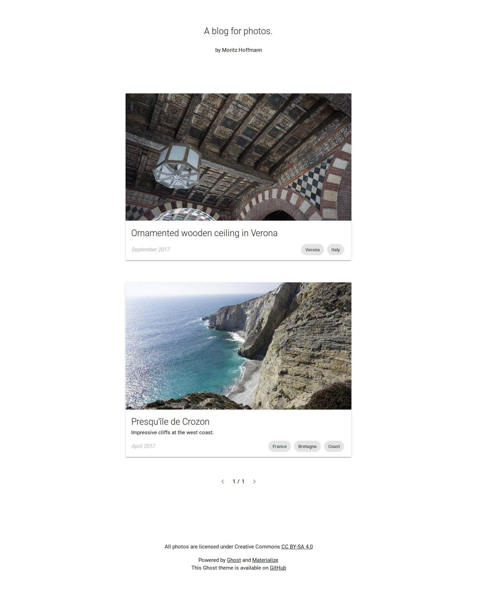

Crozon
======

A minimal Ghost theme for photos.

## Motivation

*Imagine an art museum: The artworks are well illuminated and a discreet description is placed next to them. The distance between two artworks on the wall is quite big. So, when a visitor decides to walk along the wall, he's only able to see one piece at a time. The wall is white. There are no distractions and the viewer has to move in order to have a glance at the object exposed next.*

That's the idea behind **Crozon**, a minimal Ghost theme for photos and texts. Existing Ghost themes, even the ones designed for photo-stories, are too overloaded. Many elements visible on first page load distract from the value of a single photo. Multi-column views, social media buttons, comments and other eye-catchers are completely redundant if you want to absorb the unique atmosphere of a photo or anecdote.

## Features

Every post is shown as a "card" (in material design terminology). A card comes with an image that is specified in Ghost as feature image. Below it follows a title and an optional description. As additional information are publish date as well as a list of tags shown.

Pagination is enabled by default.

This theme makes heavy use of [materializecss](http://materializecss.com/), a front-end framework that helped me to create a consistent, modern, and responsive design.

## How it looks

On desktop:

On mobile:
